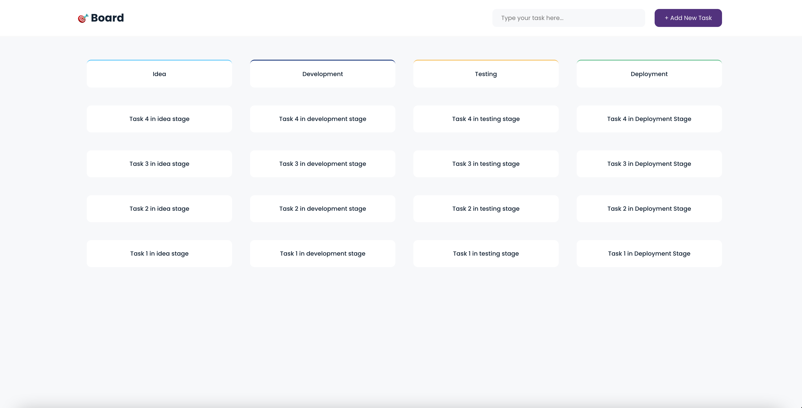
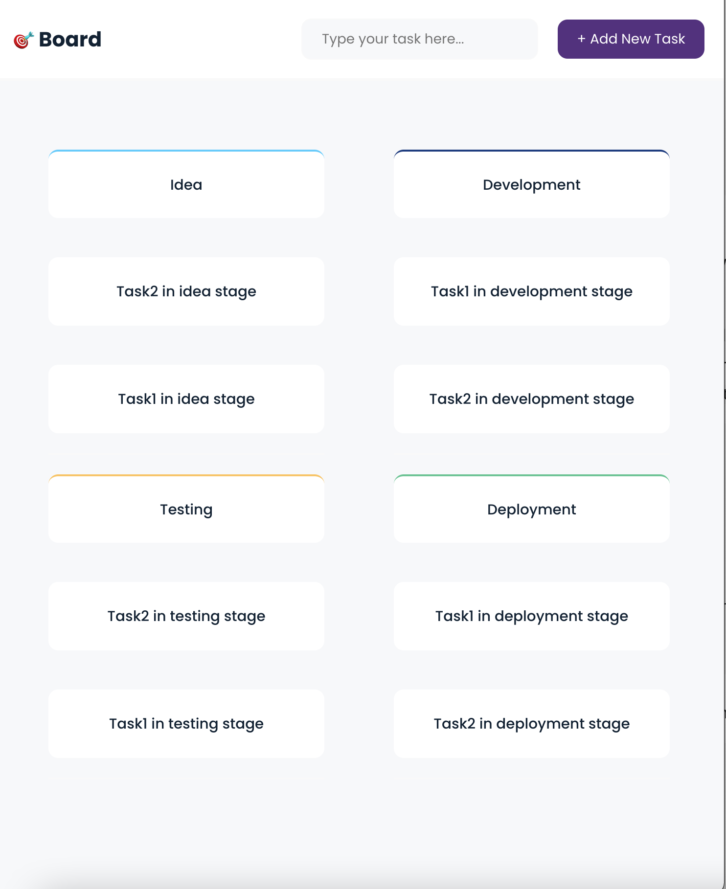
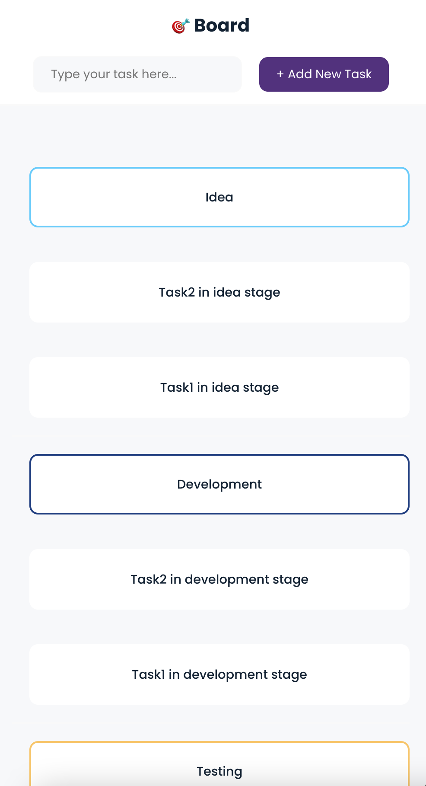

# Development

In the project directory, you can run:

## `yarn install`  

then

## `yarn start`

Open [http://localhost:3000](http://localhost:3000) to view it in the browser.

# Testing

to run unit testing

## `yarn test`

to run end to end testing

## `yarn cypress`

# Delopyment

you can check it here [https://assembly-line-tool.netlify.app/](https://assembly-line-tool.netlify.app/)

# Libraries

- [cypress](https://www.npmjs.com/package/cypress) - for end to end testing
- [@axe-core/react](https://www.npmjs.com/package/@axe-core/react) - to test the accessability
- [sass](https://www.npmjs.com/package/sass) - for styling
- [nanoid](https://www.npmjs.com/package/nanoid) - to generate unique id
- [Eslint](https://eslint.org/)
- [eslint-plugin-jsx-a11y](https://www.npmjs.com/package/eslint-plugin-jsx-a11y)

# My Approach

- created custom hook called `useAssemblyLine` to seperate the logic from the UI, it handle adding the task in the first stage, move it forward and backward.
- divided the screem to separates components: 
  `Navbar` to display the input. 
  `AssemblytItem` to display the task item and stage item. 
  `AssemblyLine` to loop through all stages and display it. 
- I used sass and created variables for colors, fonts and mixins to reuse the style code.

# unit testing

created unit testing to test the custom hook, I checked about 7 cases:

1- structuring the stages object which should be like {Idea: [], Development:[]}. 
2- adding the task at the top of the first stage. 
3- moving task to next stage when clicking left. 
4- removing the task from the current stage when moving it to the next stage. 
5- removing the task from the last stage when clicking left. 
6- removing the task from the first stage when clicking right. 
7- removing the task from the current stage when moving it to the previous stage. 

# e2e testing

I created e2e testing to test the user behaviour, here are my test cases:

1- check rendering the stages.
2- check creating two tasks and inserting it to the first stage.
3- check moving the tasks through all stages forward and backward.
4- check removing the tasks from the last and first stage.

# Idea to improve UX

1- make the task item draggable, it'd be more understandable for the user instead of clicking right and left, also we can make a simple tutorial at the first time user open the application to give him more insights about how he can move the items.

2- add button for each stage so user can directly add the new task to specific stage. 

3- add delete icon in idea and deployment stages to delete the task from it as it more desciptive than clicking right or left. 

# ScreenShots

Desktop

Tablet  

Mobile  

